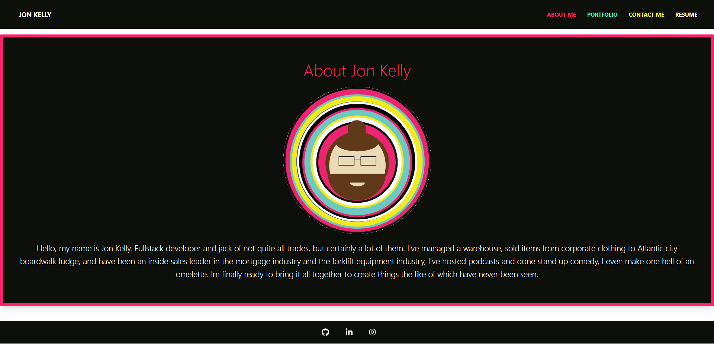

<h1 align="center">Jon Kelly's React Portfolio's ReadMe</h1>

## About The Project
This app is my new portfolio created using React

Link to repo - [https://github.com/J0nK-LE/challenge20](https://github.com/J0nK-LE/challenge20)

Link to deployed  - [https://sleepy-everglades-81475.herokuapp.com/](https://sleepy-everglades-81475.herokuapp.com/)

[![License][ISC-bdg]][ISC-url]

## Table of Contents

Table of Contents

     <ol>
       <li><a href="#about-the-project">About The Project</a></li>
       <li><a href="#installation">Installation</a></li>
       <li><a href="#usage">Usage</a></li>
       <li><a href="#license">License</a></li>
       <li><a href="#tests">Tests</a></li>
       <li><a href="#questions">Questions</a></li>
     </ol>

## Installation
either "npm start" in the terminal at the root of the code or use the deployed link
## Usage
to see the work I've done
## License
[![License][ISC-bdg]][ISC-url]
## Tests

## Questions
Email - 

GitHub - [https://github.com/J0nK-LE](https://github.com/J0nK-LE)

[MIT-bdg]:https://img.shields.io/badge/License-MIT-yellow.svg
[MIT-url]:https://opensource.org/licenses/MIT
[Apache-bdg]:https://img.shields.io/badge/License-Apache_2.0-blue.svg
[Apache-url]:https://opensource.org/licenses/Apache-2.0
[GNU-bdg]:https://img.shields.io/badge/License-GPLv3-blue.svg
[GNU-url]:https://www.gnu.org/licenses/gpl-3.0
[IBM-bdg]:https://img.shields.io/badge/License-IPL_1.0-blue.svg
[IBM-url]:https://opensource.org/licenses/IPL-1.0
[ISC-bdg]:https://img.shields.io/badge/License-ISC-blue.svg
[ISC-url]:https://opensource.org/licenses/ISC
[Mozilla-bdg]:https://img.shields.io/badge/License-MPL_2.0-brightgreen.svg
[Mozilla-url]:https://opensource.org/licenses/MPL-2.0
